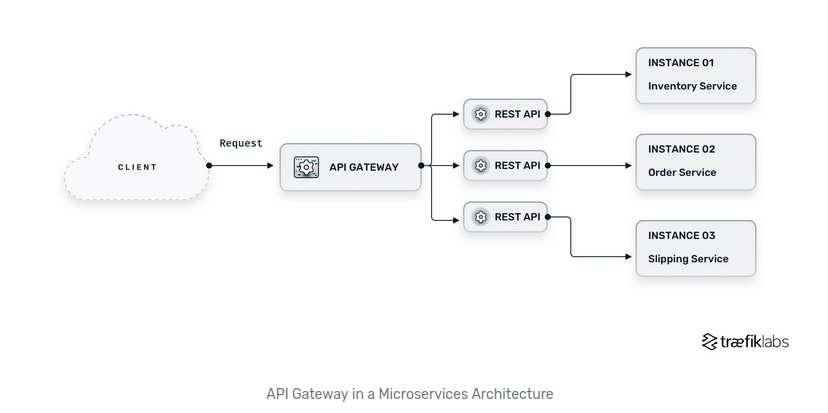
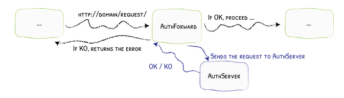

# user-service

# Overview

This project uses the following technologies:

- [postgres](https://www.postgresql.org/) for the databases.
- [go](https://go.dev/) as the server backend language.

# Badges

[](https://codecov.io/gh/Knoblauchpilze/user-service)

[](https://github.com/Knoblauchpilze/user-service/actions/workflows/build-and-push.yml)

[](https://github.com/Knoblauchpilze/user-service/actions/workflows/database-migration-tests.yml)

# What is this service about?

One of the most basic concern of any web application or service nowadays is user management. Generally, this means the code needed to keep track of who is using a service, how they can log into the service and which permissions they have.

Whether you want to implement a game or have an e-commerce website or build a platform providing some service, it is very likely that you'll have to manage users (**your** users).

This repository defines a service to help make this simple.

# Installation

## Tools to install on your system

The tools described below are directly used by the project. It is mandatory to install them in order to build the project locally.

See the following links:

- [golang](https://go.dev/doc/install): this project was developed using go `1.23.2`.
- [golang migrate](https://github.com/golang-migrate/migrate/blob/master/cmd/migrate/README.md): following the instructions there should be enough.
- [postgresql](https://www.postgresql.org/) which can be taken from the packages with `sudo apt-get install postgresql-14` for example.

## Cloning the repository

We also assume that this repository is cloned locally and available to use. To achieve this, just use the following command:

```bash
git clone git@github.com:Knoblauchpilze/user-service.git
```

## Secrets in the CI

The CI workflows define several secrets that are expected to be created for the repository when cloned/forked/used. Each secret should be self-explanatory based on its name. Most of them require to setup an account on one or the other service mentioned in the [tools](#tools-to-install-on-your-system) section.

## Deploying this service

This service is meant to work nicely in a microservice architecture. Notably, it is used in the [galactic-sovereign](https://github.com/Knoblauchpilze/galactic-sovereign) project as a base for user management.

In order to make this service play nicely with your microservice architecture, you can find an example on how to deploy it in the [ec2-deployment](https://github.com/Knoblauchpilze/ec2-deployment) project.

The `ec2-deployment` repository defines a docker compose architecture for multiple services (including this one) to handle users and authentication for the `Galactic Sovereign` game.

The CI of this project builds a docker image that can be used as you see fit.

# General architecture

## System architecture

The `user-service` is a Go service which handles users and store them in a `postgres` database. It defines various endpoints to perform the common operation on users:

- create a new user
- update it (in case of credentials change for example)
- delete it
- login and logout
- authentication

This service defines a classic layout with controllers using services, themselves using repositories to interact with the database. The interaction with the database is not using any ORM system (like [GORM](https://gorm.io/)) but just plain repositories and SQL queries defined in this repository. Considering that the system is still relatively simple this seemed to be the right choice.

## Typical user workflow

This service relies on the following base use-case:

- a user is created with a set of credentials
- this user can log into the system by providing the right credentials
- once logged in, the user is provided a temporary API key which can be used to access secured resources
- the user can logout of the system, or they get automatically logged out after a pre-configured period of time
- the user can be deleted in case it is no longer needed

Each of these actions are typically handled by a dedicated handler in the [controllers](internal/controller) package.

## The session concept

In order to allow users to be authenticated before granting access to a service, the `user-service` provides a session mechanism. It is quite a wide topic and you can find more resources on the research that went into producing the strategy used in this repository (including whether this is a RESTful approach or not) in a dedicated [PR #7](https://github.com/Knoblauchpilze/galactic-sovereign/pull/7) (this service was initially part of the `galactic-sovereign` monorepo).

Upon calling the `POST /v1/users/sessions` route (see [auth](internal/controller/auth.go) controller), the user will be able to obtain a token (see [API keys](#api-keys)), valid for a certain period of time.

Providing this token can be used as an authentication mechanism to verify that the user is who they pretend they are.

The session token is only valid for a certain amount of time and can be revoked early by calling `DELETE /v1/users/sessions/{user-id}`. Its validity duration cannot be configured at the moment and is a property of the `user-service`: this seems better from a security posture.

## API keys

We use API keys in a similar way as the session keys described in this [Kong article](https://konghq.com/blog/learning-center/what-are-api-keys). Each key is a simple identifier that is required to access our service. It is created upon logging in and deactivated upon logging out.

## The authentication endpoint

The authentication endpoint is a corner stone of the strategy: this takes any http request and look for an API key attached to it as a header:

- if there's no such header the request is denied.
- if there's one but the key is invalid (either expired or unknown) the request is denied.

Additionally, this endpoint should return any permissions that are provided to the user in the response: generally this could be a list of allowed endpoints, or the group of the user (typically an admin or a regular user).

# How to use this service to authenticate requests in a microservice cluster?

⚠️ The rest of this section will be using [traefik](https://traefik.io/traefik/) as an example for an API gateway. There are many other solutions out there but the concepts should be similar.

## Generalities

In a microservice architecture, it is common to group all services behind a single component called an API gateway. This [traefik article](https://traefik.io/glossary/api-gateway-101/) presents the following diagram (credit to their website, not this repository):



This architecture routes all incoming traffic to a single component which main goal is to dispatch the requests to the services able to handle them.

Additionally, it is not rare to include the authentication in this component as well. The idea is that instead of having this handled for each and every microservice (with potentially a lot of duplicated code), this process can live in a single place where we can ensure that it's properly done.

The purpose of the API gateway becomes to answer the following question:

```
Is this request allowed to do what it is requesting to do and who should handle it?
```

The typical workflow is to:

1. make sure that the request comes from an authenticated source
2. add context to the request with information available
3. forward the request to the corresponding service
4. delegate the authorization to each service

The `user-service` as defined in this repository helps with steps 1 and 2.

## How does it work in traefik?

Traefik has a [forwardAuth](https://doc.traefik.io/traefik/middlewares/http/forwardauth) middleware which allows (as its name suggests) to forward any request it receives to an external authentication server. Based on the response of this server it either denies or forwars the request.

As all requests are routed towards this endpoint by traefik before they reach the target service, we can guarantees an efficient filtering and only allow authenticated users to access our cluster. This is shown in the picture below:



In this diagram the `user-service` is the `AuthServer`.

## How does this service come into play?

The `user-service`'s `auth` endpoint is the one we configure to be called by the `forwardAuth` middleware. It will automatically verify that:

- the request has an API key
- that this API key is known and valid
- enrich the request with the information (such as permissions) before forwarding it to the service responsible to handle the request

It is then up to each service to check those permissions and take a decision based on whether the request should be authorized or not.

# Cheat sheet

## Create new user

```bash
curl -X POST -H "Content-Type: application/json" http://localhost:60001/v1/users -d '{"email":"user-1@mail.com","password":"password-for-user-1"}' | jq
```

## Query existing user

```bash
curl -X GET -H "Content-Type: application/json" -H 'X-Api-Key: 2da3e9ec-7299-473a-be0f-d722d870f51a' http://localhost:60001/v1/users/4f26321f-d0ea-46a3-83dd-6aa1c6053aaf | jq
```

## Query non existing user

```bash
curl -X GET -H 'Content-Type: application/json' -H 'X-Api-Key: 2da3e9ec-7299-473a-be0f-d722d870f51a' http://localhost:60001/v1/users/4f26321f-d0ea-46a3-83dd-6aa1c6053aae | jq
```

## Query without API key

```bash
curl -X GET -H 'Content-Type: application/json' http://localhost:60001/v1/users/4f26321f-d0ea-46a3-83dd-6aa1c6053aae | jq
```

## List users

```bash
curl -X GET -H 'Content-Type: application/json' '-H 'X-Api-Key: 2da3e9ec-7299-473a-be0f-d722d870f51a' http://localhost:60001/v1/users | jq
```

## Patch existing user

```bash
curl -X PATCH -H 'Content-Type: application/json' -H 'X-Api-Key: 2da3e9ec-7299-473a-be0f-d722d870f51a' http://localhost:60001/v1/users/0463ed3d-bfc9-4c10-b6ee-c223bbca0fab -d '{"email":"test-user@real-provider.com","password":"strong-password"}'| jq
```

## Delete user

```bash
curl -X DELETE -H 'Content-Type: application/json' -H 'X-Api-Key: 2da3e9ec-7299-473a-be0f-d722d870f51a' http://localhost:60001/v1/users/0463ed3d-bfc9-4c10-b6ee-c223bbca0fab | jq
```

## Login a user

```bash
curl -X POST -H 'Content-Type: application/json' http://localhost:60001/v1/users/sessions/4f26321f-d0ea-46a3-83dd-6aa1c6053aaf | jq
```

## Login a user by email

```bash
curl -X POST -H "Content-Type: application/json" http://localhost:60001/v1/users/sessions -d '{"email":"test-user@provider.com","password":"strong-password"}' | jq
```

## Login a user by email with wrong credentials

```bash
curl -X POST -H "Content-Type: application/json" http://localhost:60001/v1/users/sessions -d '{"email":"test-user@provider.com","password":"not-the-password"}' | jq
```

## Logout a user

```bash
curl -X DELETE -H 'Content-Type: application/json' -H 'X-Api-Key: 2da3e9ec-7299-473a-be0f-d722d870f51a' http://localhost:60001/v1/users/sessions/4f26321f-d0ea-46a3-83dd-6aa1c6053aaf | jq
```
